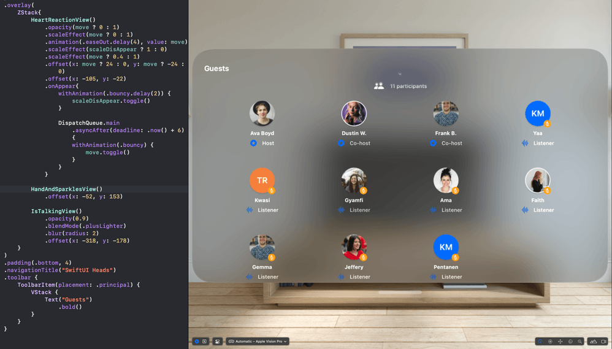
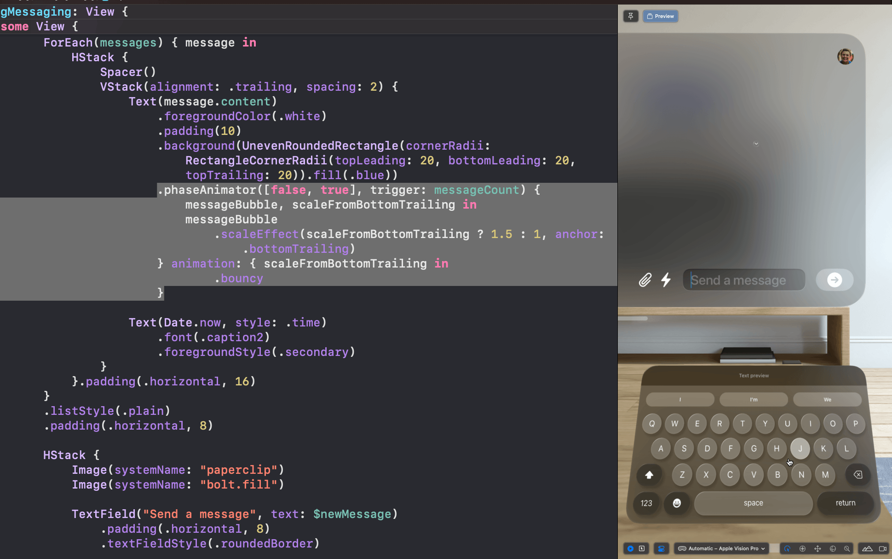

# Open visionOS: Animations and UI Designs
## visionOS animations and UI designs built with SwiftUI. Check out the [Xcode project](https://github.com/amosgyamfi/OpenvisionOS/tree/main/OpenvisionOS) for specific SwiftUI animations and designs

### Freeform drawing with PencilKit 

---

### Fireworks created with Reality Composer Pro

---

### visionSpaces/Audio Room 

---

### SwiftUI and visionOS Livetreaming animation 

---

### Animate bubbles with Phase Animator

---

